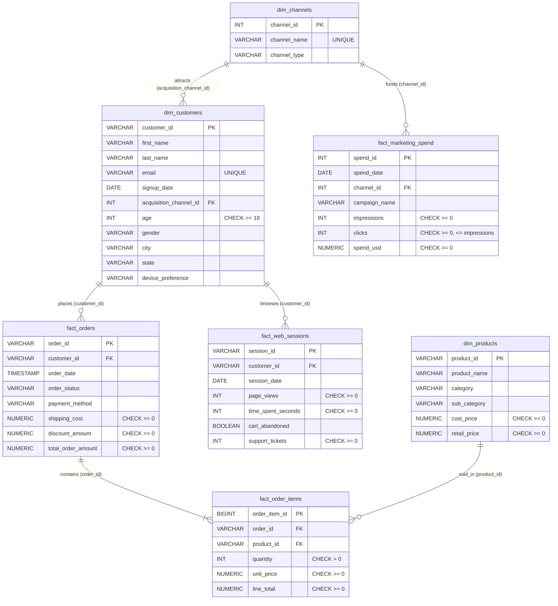

# PostgreSQL Database Architecture & Ingestion Guide

This document details the PostgreSQL 16 relational data warehouse architecture, database schema, constraints, indexing strategy, bulk data ingestion engine, and automated validation suite for the **Aura Retail Marketing & Customer Analytics Platform**.

---

## 1. Database Architecture & Container Orchestration

The database layer runs on an isolated Docker network configured in `docker/docker-compose.yml`:

```
┌─────────────────────────────────────────────────────────────┐
│                    Docker Bridge Network                    │
│                    (aura_retail_network)                    │
│                                                             │
│   ┌───────────────────────────┐  ┌───────────────────────┐  │
│   │   aura_retail_postgres    │  │  aura_retail_pgadmin  │  │
│   │   (PostgreSQL 16-alpine)  │  │     (pgAdmin 4)       │  │
│   │   Port: 5432              │  │     Port: 5050        │  │
│   │   DB: aura_retail_db      │  │     Web GUI           │  │
│   │   Schema: aura_retail     │  │                       │  │
│   └─────────────┬─────────────┘  └───────────┬───────────┘  │
│                 │                            │              │
└─────────────────┼────────────────────────────┼──────────────┘
                  │                            │
                  ▼                            ▼
            Host: 127.0.0.1:5432         Host: 127.0.0.1:5050
```

### Connection Parameters
- **Database Engine**: PostgreSQL 16 (Alpine Linux)
- **Host**: `localhost` (`127.0.0.1`)
- **Port**: `5432`
- **Database Name**: `aura_retail_db`
- **Application Schema**: `aura_retail`
- **Default Superuser**: `postgres`
- **pgAdmin 4 Web Console**: `http://localhost:5050` (User: `admin@auraretail.com`)

---

## 2. Relational Schema & Entity Relationship Diagram (ERD)

The database strictly separates the public schema from the application schema `aura_retail`. All tables reside under `aura_retail`:



---

## 3. Data Types and Technical Decisions

| Column Category | PostgreSQL Type | Rationale |
| :--- | :--- | :--- |
| **Monetary Values** | `NUMERIC(10,2)` | Avoids IEEE 754 floating-point rounding errors in financial reporting. Exact 2-decimal scale. |
| **Business Key Identifiers** | `VARCHAR(20)` / `VARCHAR(30)` | Aligns with synthetic format (`CUST_00001`, `ORD_00001`, `SESS_000001`, `PROD_001`). |
| **Numeric Identifiers** | `INT` / `BIGINT` | `dim_channels`, `fact_marketing_spend` use `INT`. `fact_order_items` uses `BIGINT` for scalability. |
| **Calendar Dates** | `DATE` | For daily events (`signup_date`, `session_date`, `spend_date`). |
| **Order Timestamps** | `TIMESTAMP` | Captures order placement time of day for intra-day purchase cadence analysis. |
| **Flags & Indicators** | `BOOLEAN` | Native PostgreSQL boolean storage for flags (`cart_abandoned`). |
| **Engagement Counts** | `INT` | Quantities, impressions, clicks, page views, and support tickets are discrete positive integers. |

---

## 4. Referential Integrity & Check Constraints

### Foreign Key Cascades
- `fact_order_items.order_id` → `fact_orders.order_id` has `ON DELETE CASCADE`. If a transaction is purged, child items are cleaned automatically.
- All other relationships enforce `RESTRICT` to prevent orphan dimensional records.

### Database Constraints Summary
- `dim_customers`: `age >= 18`
- `dim_products`: `cost_price >= 0`, `retail_price >= 0`
- `fact_orders`: `shipping_cost >= 0`, `discount_amount >= 0`, `total_order_amount >= 0`
- `fact_order_items`: `quantity > 0`, `unit_price >= 0`, `line_total >= 0`
- `fact_web_sessions`: `page_views >= 0`, `time_spent_seconds >= 0`, `support_tickets >= 0`
- `fact_marketing_spend`: `impressions >= 0`, `clicks >= 0`, `clicks <= impressions`, `spend_usd >= 0`

---

## 5. Performance Indexing Strategy

Twelve strategic indexes were created in `sql/schema/004_create_indexes.sql`:

| Index Name | Target Table & Columns | Analytical Justification |
| :--- | :--- | :--- |
| `idx_customers_acq_channel` | `dim_customers(acquisition_channel_id)` | Accelerates joins between customers and marketing channels. |
| `idx_customers_signup_date` | `dim_customers(signup_date)` | Speeds up customer cohort grouping by signup month/week. |
| `idx_orders_customer_id` | `fact_orders(customer_id)` | Speeds up customer lifetime value and order aggregation queries. |
| `idx_orders_order_date` | `fact_orders(order_date)` | Optimizes time-series revenue trends and MoM growth calculations. |
| `idx_orders_status` | `fact_orders(order_status)` | Filters delivered vs. returned vs. cancelled transactions. |
| `idx_orders_cust_date` | `fact_orders(customer_id, order_date)` | Compound index for RFM recency & cadence calculation without full table scan. |
| `idx_order_items_order_id` | `fact_order_items(order_id)` | Optimizes order header to order line joins. |
| `idx_order_items_product_id` | `fact_order_items(product_id)` | Optimizes product revenue and category margin aggregation. |
| `idx_web_sessions_customer_id` | `fact_web_sessions(customer_id)` | Joins customer sessions to customer profiles for behavioral scoring. |
| `idx_web_sessions_session_date`| `fact_web_sessions(session_date)` | Optimizes traffic and session trend queries. |
| `idx_web_sessions_cust_date`   | `fact_web_sessions(customer_id, session_date)` | Accelerates user session recency calculations. |
| `idx_marketing_spend_channel_date` | `fact_marketing_spend(channel_id, spend_date)` | Enables fast daily ROAS, CAC, and attribution joins with order revenue. |

---

## 6. High-Performance Bulk Loading

Data ingestion is performed via `src/database/loader.py` using native PostgreSQL streaming:
```sql
COPY aura_retail.<table_name> FROM STDIN WITH (FORMAT csv, HEADER true);
```
Streaming eliminates individual `INSERT` statement overhead, loading all 339,945 records in ~35 seconds.

### Loading Dependency Sequence:
1. `dim_channels` (6 records)
2. `dim_customers` (10,000 records)
3. `dim_products` (150 records)
4. `fact_orders` (50,000 records)
5. `fact_order_items` (127,596 records)
6. `fact_web_sessions` (150,000 records)
7. `fact_marketing_spend` (2,193 records)

---

## 7. Automated Validation & CSV Parity Results

Running `python -m src.database.validators` produces the following validated parity report:

```text
======================================================================
AURA RETAIL DATABASE VALIDATION REPORT
======================================================================
Overall Status: PASSED [OK]

1. Table Row Counts:
   - dim_channels          :       6 (Expected:       6) [OK]
   - dim_customers         :   10000 (Expected:   10000) [OK]
   - dim_products          :     150 (Expected:     150) [OK]
   - fact_orders           :   50000 (Expected:   50000) [OK]
   - fact_order_items      :  127596 (Expected:  127596) [OK]
   - fact_web_sessions     :  150000 (Expected:  150000) [OK]
   - fact_marketing_spend  :    2193 (Expected:    2193) [OK]

2. Primary Key Uniqueness:
   - dim_channels           (channel_id):       6 distinct / 0 duplicates [OK]
   - dim_customers          (customer_id):   10000 distinct / 0 duplicates [OK]
   - dim_products           (product_id):     150 distinct / 0 duplicates [OK]
   - fact_orders            (order_id):   50000 distinct / 0 duplicates [OK]
   - fact_order_items       (order_item_id):  127596 distinct / 0 duplicates [OK]
   - fact_web_sessions      (session_id):  150000 distinct / 0 duplicates [OK]
   - fact_marketing_spend   (spend_id):    2193 distinct / 0 duplicates [OK]

3. Foreign Key Referential Integrity:
   - dim_customers -> dim_channels         : 0 orphan records [OK]
   - fact_orders -> dim_customers          : 0 orphan records [OK]
   - fact_order_items -> fact_orders       : 0 orphan records [OK]
   - fact_order_items -> dim_products      : 0 orphan records [OK]
   - fact_web_sessions -> dim_customers    : 0 orphan records [OK]
   - fact_marketing_spend -> dim_channels  : 0 orphan records [OK]

4. Check Constraints:
   - 16 constraints checked: 0 violations [OK]

5. Date Boundaries & Temporal Order:
   - Date Bounds Valid (2024-01-01 to 2025-12-31): True [OK]
   - Orders placed after Signup: True (0 violations) [OK]

6. CSV vs PostgreSQL Parity:
   - Gross Revenue (fact_orders): CSV=$17,009,287.54 | DB=$17,009,287.54 (Match: True)
   - Line Items Total (fact_order_items): CSV=$17,888,372.18 | DB=$17,888,372.18 (Match: True)
   - Marketing Spend (fact_marketing_spend): CSV=$2,224,153.85 | DB=$2,224,153.85 (Match: True)
======================================================================
```

---

## 8. Reproducible Command Workflow

### Start PostgreSQL & pgAdmin
```powershell
docker compose -f docker/docker-compose.yml up -d
```

### Full Pipeline: Schema Setup, Bulk Ingestion & Validation
```powershell
python -m src.database.load_data --reset
```

### Run Independent Validation
```powershell
python -m src.database.validators
```

### Run Automated Pytest Suite
```powershell
python -m pytest tests/test_database.py -v
```
